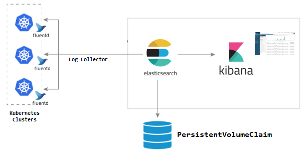

# kubernetes-efk

This repository contains the config to deploy an EFK stack on to an existing Kubernetes cluster. 

## Architecture



In the current state:

- Fluentd is deployed as a DaemonSet, and will send corresponding logs defined in `kubernetes-conf.yaml` to ElasticSearch.

- Elasticsearch is deployed as a StatefulSet binding with PVC of AWS EBS.

- Kibana is deploy as a Deployment acts a stateless service that consumes data from ElasticSearch.

## Installation

- Setup `KUBECONFIG` in local so as to enable the auth to k8s cluster

- Setup efk namespace

  ```
   kubectl create namespace efk
  ```

- Setup node label

  ```
   kubectl label nodes k8s-node-1 node.logging=efk
  ```

- Run `auto/deploy-es` to deploy elasticsearch

- Initialize es credentials

  Once finished es deployment, run the following CMD to initialize es user credentials for any services that need talk to es

  ```
  kubectl exec -it -n efk \
  $(kubectl get pods -n efk | grep es-cluster | sed -n 1p | awk '{print $1}') \
  -- bin/elasticsearch-setup-passwords auto
  Changed password for user apm_system
  PASSWORD apm_system = xxxxxxxxxxxxxxxxx

  Changed password for user kibana
  PASSWORD kibana = xxxxxxxxxxxxxxx

  Changed password for user logstash_system
  PASSWORD logstash_system = xxxxxxxxxxxxxxxx

  Changed password for user beats_system
  PASSWORD beats_system = xxxxxxxxxxxxxxx

  Changed password for user remote_monitoring_user
  PASSWORD remote_monitoring_user = xxxxxxxxxxxxxxxx

  Changed password for user elastic
  PASSWORD elastic = xxxxxxxxxxxxxxxxxxxxxx
  ```

- Create es user/password via `secret`

  ```
  kubectl create secret -n efk generic es-secret \
    --from-literal=user=elastic \
    --from-literal=password=xxxxxxxxxxxxxxxxxxxxxx
  ```

- Run `auto/deploy-fluentd` to deploy fluentd

- Create es user/password for kibana via `secret`

  ```
  kubectl create secret -n efk generic kibana-secret \
    --from-literal=user=kibana \
    --from-literal=password=xxxxxxxxxxxxxxx
  ```

- Run `auto/deploy-kibana` to deploy kibana


- Forward kibana service to local

  ```
  kubectl port-forward -n efk svc/kibana 5601:5601
  ```

- Access the Kibana dashboard via elastic/xxxxxxxxxxxxxxx

  http://localhost:5601

- Checking anything happened from logs

  ```
  kubectl logs -n efk [statefulset/es-cluster | ds/fluentd | deployment/kibana] -f
  ```

## Debug

### Current Shards are exceeding the max size

As time goes by, elastic would face `cluster.max_shards_per_node` squeezing issue if no more larger shard value is defined since its default value is `1000`.

It would cause kibana could not receive latest logging message.

Solution:

- Set `cluster.max_shards_per_node` a large number in elasticsearch.yml, i.e `cluster.max_shards_per_node: 10000`

- Check existing elastic indices in CLI
    ```
    kubectl exec -it -n efk es-cluster-68886645c5-kt8pn -- bash
    $ curl -u elastic:xxxxxxx  localhost:9200/_cat/indices
    ```

- Cleanup obsolete or unassigned shards

    ```
    curl -XGET -u elastic:xxxxxx http://localhost:9200/_cat/shards | grep UNASSIGNED |awk {'print $1'} | xargs -i curl -XDELETE -u elastic:xxxxxx "http://localhost:9200/{}"
    ```
